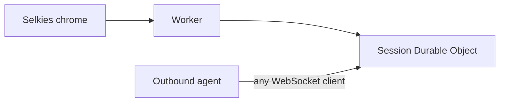
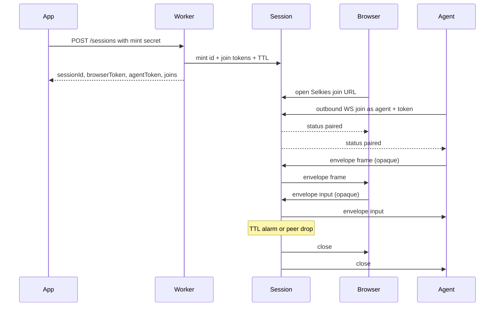

# Jolee Remote


Short-lived browser↔agent session pairing on Cloudflare Durable Objects.

Mint a session, pair one browser WebSocket with one outbound agent WebSocket, forward opaque `frame` / `input` bytes, hibernate, and tear down on TTL or peer drop.

You bring auth, devices, and capture/agent logic. There is no hosted demo — deploy the Worker to your own Cloudflare account.

**Selkies chrome** at `/` is the product session UI (modified Selkies dashboard chrome, not the Selkies streaming stack). `/viewer.html` is the canvas hole that chrome iframes.

## Quick start

```bash
npm install
npm test
npx wrangler dev
```

Local `wrangler dev` listens at `http://127.0.0.1:8787` with `MINT_SECRET` unset (open mint). HTML and hop share that origin.

Mint a session (open mint locally):

```
POST http://127.0.0.1:8787/sessions
Content-Type: application/json
{"ttlSeconds": 900}
```

The `201` body includes `sessionId`, `browserToken`, `agentToken`, and `joins`. `joins.browser` is a **path on the hop Worker** (`/?session=<id>&hop=127.0.0.1:8787#token=<browserToken>`). Open it on the local origin, or construct:

```
http://127.0.0.1:8787/?session=<id>#token=<browserToken>
```

Omit `hop` when HTML and Worker share an origin (defaults to this origin). Prefer the fragment `#token=` so referrers and Worker logs do not retain the token; `?token=` remains a fallback.

Run the sample agent against the hop (defaults to `ws://127.0.0.1:8787`):

```bash
node examples/agent.mjs <sessionId> <agentToken>
```

Once both peers are paired, the hop forwards placeholder frames (plus one cursor JSON frame so the overlay can swap to a bitmap) and prints pointer/key/wheel input.

**Production layout:** serve session HTML on a host you control (docs use `https://remote.example.com` as a placeholder — any hostname works). The hop Worker may be the same origin or a different host — that is the `hop` query param. When HTML and Worker are split:

```
https://remote.example.com/?session=<id>&hop=<worker-host>#token=<browserToken>
```

Set Worker secret `MINT_SECRET` and mint against the Worker host (not the HTML host unless they share an origin).

## Architecture



The Durable Object is the WebSocket **server**. The agent is an outbound WebSocket **client**. The DO never opens outgoing sockets, so connections can hibernate.



More diagrams: [docs/architecture.md](docs/architecture.md).

## Byte envelope

The hop does not interpret pixels or OS events. Every binary WebSocket message follows:

| Offset | Size | Field |
| --- | --- | --- |
| 0 | 1 | version (`0x01`) |
| 1 | 1 | kind: `0x01` frame (agent to browser, JPEG/WebP), `0x02` input (browser to agent, JSON opaque), `0x03` audio (agent to browser, media chunk) |
| 2.. | n | opaque payload |

Malformed envelopes and unknown kinds are dropped. Frames and audio flow only agent → browser; input flows only browser → agent. Pairing must be complete before bytes flow. Image clipboard stays on input JSON / JSON frame; audio uses kind `0x03` as a byte stream like frames.

Cloudflare Durable Objects accept received WebSocket messages up to **32 MiB** ([limits](https://developers.cloudflare.com/durable-objects/platform/limits/)). This hop drops envelopes larger than **1 MiB** (`MAX_ENVELOPE_BYTES`) so JPEG/WebP stills at low fps stay inside a conservative cap.

Text WebSocket messages are Durable Object control JSON, not the envelope:

`{"type":"status","sessionId":"...","state":"waiting|paired|expired","expiresAt":0,"browserConnected":true,"agentConnected":true}`

A connecting peer may send `{"type":"join","token":"..."}` as its first text message instead of placing the token in the query string.

Suggested viewer payloads (opaque to the hop): UTF-8 JSON inside kind `input`, e.g. `{ "t": "pointer", "e": "move", "x": 0.5, "y": 0.5 }` or `{ "t": "wheel", "dx": 0, "dy": 120, "x": 0.5, "y": 0.5 }`. Frame payloads are typically JPEG/WebP stills — the viewer paints with `createImageBitmap` / `drawImage`. A JSON frame `{ "t": "cursor", "visible": true, "hx": 0, "hy": 1, "mime": "image/png", "data": "..." }` sets the overlay shape (position follows the local pointer).

## HTTP and WebSocket

Session HTML is served from your chosen origin (placeholder in docs: `https://remote.example.com`). The hop Worker may be a different host (`hop` query param). Same origin: omit `hop`.

- `POST /sessions` on the hop Worker. Optional JSON `{ "ttlSeconds": 900 }` (1..3600, default 900). **Production requires `MINT_SECRET`**: send `Authorization: Bearer <MINT_SECRET>` or `X-Mint-Secret`. Unset in local `wrangler dev` keeps open mint. Returns `sessionId`, `browserToken`, `agentToken`, `expiresAt`, `ttlSeconds`, `joins`.
- `GET /sessions/:id` — public status; does **not** return tokens.
- **Browser HTML:** `https://remote.example.com/?session=<id>#token=<browserToken>` (same origin) or `https://remote.example.com/?session=<id>&hop=<worker-host>#token=<browserToken>` (split). Mint `joins.browser` is that path on the hop Worker, not a full `https://remote.example.com/...` URL unless UI and hop share an origin. See [docs/chrome.md](docs/chrome.md).
- **Agent join** (any WebSocket client; PartySocket not required): prefer first text `{"type":"join","token":"..."}` or `Authorization: Bearer` on the upgrade. Query `?token=` remains fallback (`joins.agent`: `wss://<worker-host>/sessions/<id>/agent?token=`).
- PartySocket `/parties/session/:id?role=browser&token=...` is how the canvas hole (`/viewer.html`) opens the browser socket — not a second product join.

Auth in this repo is the mint secret plus mint-time join tokens. No tenants, device directory, portal, or fleet agent. Pairing is 1:1; N browsers is a later consumer need. For tiered product access (Access for identity, Workers for ACL/mint), see [docs/architecture.md](docs/architecture.md#host-authorization-tiers).

## Building the agent

Integration guide (mint secret, Selkies join URL, envelope, token paths): [docs/agent.md](docs/agent.md). Consumer tool map: [docs/consumer-tools.md](docs/consumer-tools.md). Session print (viewer shipped; consumer printer cited to IronRDP): [docs/print-redirect.md](docs/print-redirect.md).

The agent is a WebSocket **client**.

1. Call `POST /sessions` with the mint secret; receive `sessionId`, `browserToken`, `agentToken`, and `joins`. Open the session page (`https://remote.example.com/?session=<id>#token=<browserToken>`; add `&hop=<worker-host>` if the Worker is elsewhere).
2. Connect outbound:

   `wss://<worker-host>/sessions/<sessionId>/agent?token=<agentToken>`

   Prefer omitting the query token and sending `{"type":"join","token":"<agentToken>"}` as the first text message, or `Authorization: Bearer <agentToken>` on the upgrade. Query string is fallback. Any WebSocket client works.
3. Wait for a `status` message with `state: "paired"` (browser connected).
4. Send binary envelopes with kind `frame` (`0x01`) and JPEG/WebP stills under 1 MiB. Optional kind `audio` (`0x03`) is a complete media chunk agent → browser. Read kind `input` (`0x02`) JSON payloads and apply them on the device.
5. Browser drop or TTL expiry ends the session. Later joins are rejected.

Rejects: mint `401` without secret when configured; second browser or second agent `409`; expired `410`; unknown session `404`; bad token `403`.

Hibernation: the session class extends `partyserver` `Server` with `static options = { hibernate: true }`. Connections are tagged `browser` / `agent` via `getConnectionTags`. After wake, the platform restores tags and the DO routes with them. One Durable Object alarm enforces TTL.

## Session UI

Same origin:

```
https://remote.example.com/?session=<id>#token=<browserToken>
```

Split origin (HTML on `remote`, Worker elsewhere):

```
https://remote.example.com/?session=<id>&hop=<worker-host>#token=<browserToken>
```

That opens **Selkies chrome** (modified dashboard, MPL-2.0) at `/`. Chrome iframes `/viewer.html` (canvas hole: PartySocket + envelope + paint + input + postMessage). Mint `joins.browser` / `viewerPath` in `src/joins.ts` is the path on the hop Worker — prefix `https://remote.example.com` when the HTML host differs.

The shell copies search params except `token` onto the hop-core iframe and places the token on the iframe hash, which auto-connects. A host app may also postMessage `connect` / `disconnect` (plus `requestFullscreen`, `setScaleLocally`, `showVirtualKeyboard`, `clipboardUpdateFromUI`) to the iframe. The core posts status `waiting` | `paired` | `expired` | `disconnected`. See [docs/chrome.md](docs/chrome.md).

## Sample client

```
node examples/agent.mjs <sessionId> <agentToken>
node examples/agent.mjs <sessionId> <agentToken> wss://hop.example.com
```

Connects outbound as the agent to the hop Worker (not the HTML host), sends placeholder PNG frames plus one cursor JSON frame, and prints input. Proves the pipe and overlay; not a real capture agent or Windows SendInput product. Optional third arg is the hop WebSocket origin; default `ws://127.0.0.1:8787`.

## Develop

Package scripts: `typecheck`, `test`, `dev` (`wrangler dev`), `build:dashboard`, `sync:dashboard`. Dashboard chrome builds from `chrome/selkies-dashboard`. Tests use `@cloudflare/vitest-pool-workers`. Deploy the Worker on your own Cloudflare account; this repo has no hosted demo.

Local `wrangler dev` leaves `MINT_SECRET` unset (open mint). Production requires Worker secret `MINT_SECRET`.

## Keeping chrome in sync

This repo ships modified Selkies dashboard chrome, not the Selkies streaming stack (no selkies-web-core).

Do not bump packages past upstream pins: dashboard npm follows the pinned Selkies package.json; wrangler, workers-types, partyserver, and partysocket follow those sources, not latest-on-npm.

- **Dependabot** (weekly Monday) covers npm at `/` and `/chrome/selkies-dashboard`, plus GitHub Actions at `/`.
- **Pin:** `chrome/selkies-dashboard/UPSTREAM` records the Selkies repo, path, and commit. Files listed in `OVERLAY` are never overwritten. Jolee rewires live in `chrome/patches/selkies-dashboard/`.
- **Bump:** `./scripts/sync-selkies-dashboard.sh` with no args re-applies the pinned SHA; pass `latest` or a commit SHA to move the pin. Refresh the patch series if apply fails. Same command: `npm run sync:dashboard`.
- **Watch:** a weekday GitHub Action compares the pin to upstream and opens an issue titled "Selkies dashboard upstream moved" when they differ.

License: MIT for the hop; dashboard chrome is MPL-2.0 (see chrome/selkies-dashboard/LICENSE and NOTICE).
