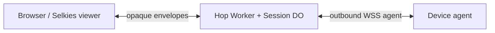

# Agent integration

Your backend mints a session on the hop Worker, opens the Selkies HTML URL, and your agent outbound-connects to the Worker. The hop pairs exactly one browser socket with exactly one agent socket and forwards opaque `frame` / `input` / `audio` bytes. Pairing is 1:1; N browsers is a later consumer need.

Join URL helpers live in `src/joins.ts` (`viewerPath` is the product browser join).

## Mint

Serve session HTML from any origin you control (docs placeholder: `https://remote.example.com`). Pass `hop` only when the Worker is on another host.

Your app: `POST /sessions` on the hop Worker with optional JSON `{ "ttlSeconds": 900 }` (clamped 1..3600). Default when omitted: Worker var `SESSION_TTL_SECONDS` (default `"900"`).

**Production requires a mint secret.** Set Worker env `MINT_SECRET` and send it as:

- `Authorization: Bearer <MINT_SECRET>`, or
- `X-Mint-Secret: <MINT_SECRET>`

Missing or wrong secret → `401`. Local `wrangler dev` with `MINT_SECRET` unset keeps open mint so you can iterate without a secret; production must set one (`wrangler secret put MINT_SECRET`).

Local (open mint):

```bash
curl -sS -X POST http://127.0.0.1:8787/sessions -H 'content-type: application/json' -d '{"ttlSeconds": 900}'
```

Production (Worker host, not the HTML host unless they share an origin):

```bash
curl -sS -X POST https://hop.example.com/sessions -H 'Authorization: Bearer …'
```

HTTP `201`. Example local mint body:

```json
{
  "sessionId": "3fa85f64-5717-4562-b3fc-2c963f66afa6",
  "browserToken": "0123456789abcdef0123456789abcdef0123456789abcdef0123456789abcdef",
  "agentToken": "fedcba9876543210fedcba9876543210fedcba9876543210fedcba9876543210",
  "expiresAt": 1770000000000,
  "ttlSeconds": 900,
  "joins": {
    "browser": "/?session=3fa85f64-5717-4562-b3fc-2c963f66afa6&hop=127.0.0.1:8787#token=0123456789abcdef0123456789abcdef0123456789abcdef0123456789abcdef",
    "agent": "/sessions/3fa85f64-5717-4562-b3fc-2c963f66afa6/agent?token=fedcba9876543210fedcba9876543210fedcba9876543210fedcba9876543210"
  }
}
```

Store `sessionId`. Response also has `browserToken`, `agentToken`, `expiresAt`, `ttlSeconds`, and `joins`:

- `joins.browser` — path on the hop Worker: `/?session=<id>&hop=<worker-host>#token=<browserToken>` (mint sets `hop` from the Worker Host). If the HTML is on another host, your app builds `https://remote.example.com/?session=<id>&hop=<worker-host>#token=<browserToken>`. Same origin: you can omit `hop`.
- `joins.agent` — agent WebSocket path with query-token fallback

## Open the session (browser)

Same origin (HTML served by the Worker):

```
https://remote.example.com/?session=<id>#token=<browserToken>
```

Split origin (HTML on `remote`, Worker elsewhere):

```
https://remote.example.com/?session=<id>&hop=<worker-host>#token=<browserToken>
```

That opens **Selkies chrome**. `hop` is the Worker host. Omit it when HTML and Worker share an origin. Mint `joins.browser` is the matching path on the Worker (`viewerPath`); if the HTML host differs, prefix `https://remote.example.com` and keep `hop`.

`/viewer.html` is the canvas hole the chrome iframes. PartySocket `/parties/session/:id?role=browser&token=` is how that hole connects, not a second product join.

## Agent join

Hand the agent `sessionId` plus the agent URL and token. Any WebSocket client (do not require PartySocket):

```
wss://<worker-host>/sessions/<id>/agent?token=<agentToken>
```

Token paths (query is fallback):

1. First text message after upgrade: `{"type":"join","token":"<agentToken>"}` on `wss://<worker-host>/sessions/<id>/agent`
2. `Authorization: Bearer <agentToken>` on the WebSocket upgrade
3. Query string `?token=` (fallback; still what `joins.agent` returns)

The agent is the WebSocket **client**. The session Durable Object is the WebSocket **server** and may hibernate. The DO never dials out.

## Pairing

Wait for a **text** JSON control message with `type: "status"` and `state: "paired"` before sending frames. Binary envelopes sent before both peers are in are dropped. 1:1 pairing only.

Shape:

`{"type":"status","sessionId":"...","state":"waiting|paired|expired","expiresAt":0,"browserConnected":true,"agentConnected":true}`

## Envelope

Every binary WebSocket message:

| Offset | Size | Field |
| --- | --- | --- |
| 0 | 1 | version (`0x01`) |
| 1 | 1 | kind: `0x01` frame (agent → browser, H.264 or JPEG/WebP), `0x02` input (browser → agent, JSON opaque), `0x03` audio (agent → browser, complete media chunk) |
| 2.. | n | opaque payload |

No RFB. The hop does not interpret pixels, codecs, or OS events. Malformed envelopes and unknown kinds are dropped. Frames and audio only from the agent connection to the browser connection. Input only from the browser connection to the agent connection. `encodeEnvelope` / `decodeEnvelope` are in `src/envelope.ts`.

### Applying input (viewer JSON)

The hop forwards input bytes opaquely. The Selkies chrome viewer sends UTF-8 JSON in kind `input`. Honor these shapes on the device. Helpers: `parseInputPayload` / `parseInputJson` from `src/input.ts` (re-exported by `src/agent-tools.ts`); CAD spellings normalize like the viewer to `ctrl-alt-delete`.


- `{t:"pointer", e, x, y, b}` — `e` is `move` / `down` / `up`; `x`/`y` are 0–1 over the displayed image (`object-fit` contain vs stretch). `b` is `buttons` on move, `button` on down/up
- `{t:"wheel", dx, dy, x, y}` — canvas wheel; `dx`/`dy` are `deltaX`/`deltaY`; context menu is suppressed so right-click stays in the session
- `{t:"key", e, key, code}` — `e` is `down` / `up`. Keys are captured on the canvas after pointerdown focus, not from dashboard `.allow-native-input`
- `{t:"clipboard", text, id?}` — browser → agent (sidebar PC Clipboard, text). Optional correlation `id` is 1–64 characters. The current text receiver limit is 16,384 UTF-16 units, with no NUL or unpaired surrogates; never truncate.
- `{t:"clipboard", mime, data}` — browser → agent image clipboard. `mime` starts with `image/` (default `image/png`); `data` is base64. The viewer skips the send if the encoded envelope would exceed 1 MiB.
- `{t:"resize", w, h}` — set capture size from the original screen panel
- `{t:"resize", w, h, reset:true}` — reset capture size to `round(innerWidth)` / `round(innerHeight)`
- `{t:"cssScaling", value}` — HiDPI / CSS scaling (`setUseCssScaling`)
- `{t:"settings", settings}` — sidebar settings object (DPI, force aligned, …)
- `{t:"audioDevice", context, deviceId}` — original audio panel device select
- `{t:"pipeline", pipeline, enabled}` — chrome pipeline toggle (`audio` mutes playback in the viewer)
- `{t:"mic", mime, data}` — browser microphone `MediaRecorder` chunk; `data` is base64
- `{t:"file", name, mime, data}` — browser → agent upload in kind `0x02`; `data` is base64. The consumer agent writes into its PC `FileManagerPath` / Desktop root; the consumer owns path resolution.
- `{t:"webcam", mime:"image/jpeg", data}` — periodic browser webcam JPEG still; `data` is base64
- `{t:"command", command:"ctrl-alt-delete"}` — normalized secure-attention shortcut; other command payloads are forwarded
- `{t:"ping", id}` — latency probe; `id` is a nonempty string of at most 64 characters. Reply on the same paired session with a frame envelope containing `{t:"pong", id}`. Echo only the ID; do not execute input or return host information. The browser sends probes every 5 seconds with at most one pending, rejects replies after 10 seconds, and expires measured round-trip latency after 15 seconds. It measures elapsed time locally, so clocks need not be synchronized. Agents without this capability leave latency unavailable.

To fill the sidebar PC Clipboard, the agent may send a *frame* envelope whose payload is UTF-8 JSON (not pixels). The hop does not parse it; the viewer does:

- `{"t":"clipboard","text":"..."}` — posts `clipboardContentUpdate` `{text}` to the parent
- `{"t":"clipboard","mime":"image/png","data":"<base64>"}` — posts `clipboardImageUpdate` `{mime, data}` to the parent (the sidebar may ignore inbound images)

The same JSON-frame pattern carries the remote cursor *shape* (not pointer position). Overlay position follows the local pointer so it does not wait on JPEG fps; the agent supplies the bitmap + hotspot. Default overlay is a drawn arrow until a cursor frame arrives. Do not add envelope kind `0x04`.

- `{"t":"cursor","visible":true,"hx":0,"hy":1,"mime":"image/png","data":"<base64>"}` — show overlay, set hotspot (`hx`,`hy`) and swap the overlay image
- `{"t":"cursor","visible":false}` — hide the overlay
- Missing `visible` means shown. If `mime`/`data` are omitted, keep the current (or default) arrow

Pointer / key / wheel remain **input** JSON (browser → agent). Cursor JSON is a **frame** (agent → browser). CSS cursors toggle (original dashboard UI) hides the overlay and uses a normal local pointer; default is the remote overlay (`canvas.style.cursor='none'`).

An agent can send more JSON frame shapes:

- `{t:"file", name, mime, data}` — agent → browser push download (including canary) in kind `0x01`; triggers a browser download from base64 data. This is distinct from a `filesGet` response below.
- `{t:"stats", system_stats, gpu_stats, fps, network_stats, currentAudioLevel}` — optionally fill the CPU, memory, GPU, latency, and audio gauges. `system`/`gpu`/`network` and `audio_level` aliases are accepted. The viewer measures FPS and bandwidth when those fields are absent.
- `{t:"print", mime, name, data}` — finished session print job (prefer `application/pdf` after agent PostScript→PDF). Optional chunking: `job`, `part`, `parts` where each `data` is base64 of a byte slice. Viewer opens browser print preview; see [print-redirect.md](print-redirect.md).

A consumer applies pointer/key/wheel to the OS. Windows SendInput is out of this repo. Sample `examples/agent.mjs` proves the pipe + can send one cursor bitmap; it only logs input.

Image clipboard and cursor stay on input JSON / JSON frame (kind `0x02` / kind `0x01`). Do not invent extra envelope kinds except audio `0x03`: audio is a byte stream like frames, so it is its own kind. The hop does not decode codecs. The viewer plays kind `0x03` as a complete media chunk (`Blob` + `Audio`; tries `audio/webm`, `ogg`, `wav`, `mpeg`).

Frames and audio stay agent → browser. Input stays browser → agent.

### Files (locked Option A)

List/get use UTF-8 JSON inside the existing input / frame envelopes. The consumer agent applies them to its PC `FileManagerPath` / Desktop root, including uploads above. The consumer owns PC path resolution. The Session DO may correlate Worker `askAgentFilesList` / `askAgentFilesGet` RPC waits against agent frame replies (still no PC path logic in the hop); browser↔agent forward stays opaque for other payloads.

| Operation | Direction / kind | JSON payload shape |
| --- | --- | --- |
| List request | browser/Worker → agent, `0x02` input | `{"t":"filesList","path":"a/b"}` (`path` optional) |
| List response | agent → browser/Worker, `0x01` frame | `{"t":"filesList","path":"a/b","files":[{"id":"a/b/report.txt","name":"report.txt","type":"file","size":123,"mtime":1788819897275}]}` |
| Get request | browser/Worker → agent, `0x02` input | `{"t":"filesGet","name":"a/b/report.txt"}` |
| Get success | agent → browser/Worker, `0x01` frame | `{"t":"filesGet","name","mime","data"}` |
| Get error | agent → browser/Worker, `0x01` frame | `{"t":"filesGet","name","error":"not_found"\|"too_large"\|"unavailable"}` |

- Listing returns one directory level. Omitted/empty request `path` means root; responses echo `path` (`""` at root). Each entry has a root-relative `id`, immediate basename `name`, `type: "dir" | "file"`, byte `size` (0 for directories), and UTC Unix millisecond `mtime`. No synthetic `..` entries; omit reparse points.
- `filesGet.name` accepts a basename or nested relative ID. Success `data` is base64; responses echo the requested ID. Upload remains a basename into the root.
- HTTP and RPC paths must be clean `/`-separated relative paths: reject backslashes, empty segments, `.`/`..`, absolute/drive paths, control characters, `<>:"|?*`, trailing dots/spaces, Windows reserved device names, and alternate data streams. The agent must enforce root containment and reject reparse/junction traversal; normalize agent-internal backslashes to `/` in IDs/path echoes.
- `askAgentFilesList(path?)` correlates replies by echoed path; `askAgentFilesGet(name)` correlates by relative ID. Invalid list replies do not resolve a wait (12-second timeout); missing agents return unavailable. Legacy root replies without `path`/`id`/`type` are accepted as root files. Subfolders require agent 0.5.89+; legacy root list/get works with 0.5.87+.
- Every whole binary envelope must be ≤ **1 MiB** (`MAX_ENVELOPE_BYTES = 1048576`), including the two-byte header, JSON, and base64 expansion — the same cap as existing file pull. No new transfer protocol or envelope kinds.
- UI **Download Files** and the `letleeadmin` CLI target the same PC folder via the Worker asking the paired agent. A Session DO inbox, if a consumer uses one, is interim only; the end state is the PC folder.

#### Public HTTP folder browse

`GET /api/files/?session=SESSION&token=TOKEN` serves the vendored Selkies fancyindex. `GET /api/files/a/b/` lists `a/b`; `GET /api/files/a/b/report.txt` downloads that relative ID with `Content-Disposition: attachment`. Directory URLs end in `/`; `/api/files` redirects to `/api/files/`. Add `format=json` to a directory URL for `{sessionId, source:"pc", path, files:[{id,name,type,size,mtime}]}`.

Supply the session via `?session=` or `jolee_session` cookie; supply a session token via `?token=`, `Authorization: Bearer TOKEN`, or `jolee_browser_token` cookie (in that order). Both browser and agent session tokens are accepted. A different explicit session cannot reuse stale cookie credentials. Successful responses set Secure, HttpOnly, SameSite=Lax cookies scoped to `/api/files`; responses are `no-store`. The HTML uses those cookies for folder navigation. No Access/service authentication is required or implemented by this public hop.

Missing credentials return 401, invalid/expired session tokens 403, unsafe paths 400, missing files 404, oversized downloads 413, and unavailable agents/timeouts 503. HTTP writes return 405; uploads keep the existing file envelope path.

### Leftover (no hop yet)

Apps and sharing have no hop yet. Gaming stays out unless asked. Encoder / video settings belong to the capture agent; there is no pixelflux on this hop.

Shipped viewer contract for session print: agent → hop → browser may send `{t:"print", mime, name, data}` (optional `job` / `part` / `parts` for chunking under the 1 MiB envelope). The viewer opens the browser print dialog / preview for PDF (and images); non-printable mime falls back to download. The **session-only virtual printer** (appear on pair, remove on teardown) and PostScript→PDF conversion stay **consumer agent** work — not in this repo. Silent OS spool is desktop-client only; the web viewer always uses the browser print UI. See [print-redirect.md](print-redirect.md). Cite IronRDP ironrdp-rdpdr for Create/Write/Close job semantics when building the consumer.

Visible chrome after this hop: screen and agent-owned encoder preference (default H.264; JPEG fallback) + frame-rate/JPEG-quality settings, PC clipboard text+image, audio playback, microphone capture, files, webcam, stats, a Ctrl+Alt+Del shortcut, fullscreen, theme, and mobile keyboard. Paint-over and other Selkies-only encoder controls remain hidden.

### Max binary message size

Cloudflare Durable Objects accept received WebSocket messages up to **32 MiB** ([platform limits](https://developers.cloudflare.com/durable-objects/platform/limits/)). This hop drops envelopes larger than **1 MiB** (`MAX_ENVELOPE_BYTES = 1048576`) so JPEG/WebP stills at low fps stay inside a conservative cap. Oversize frames are not forwarded; the session stays up.

## Rejects and teardown

- `401` mint secret missing/wrong (when `MINT_SECRET` is configured)
- `403` bad join token (upgrade with query or `Authorization`)
- `404` unknown session
- `409` second peer (second browser or second agent)
- `410` expired

First-message join failures close the socket (`4003` invalid token, `4009` role already connected) instead of an HTTP status.

TTL alarm or either **joined** peer dropping ends the session. Later joins are rejected. A socket that never sent a join token does not tear the session down.


## Pairing (agent builder view)



1:1 pair only. Wait for `status` / `paired` before binary frames. Capture and inject are agent-local; the hop only forwards.

## Consumer tool map

What existing tools to use for capture, input, print, clipboard, audio, etc.: [consumer-tools.md](consumer-tools.md). Print detail: [print-redirect.md](print-redirect.md).

## What you keep vs the hop

**Hop:** mint, 1:1 pair, forward opaque envelopes, hibernate, TTL teardown.

**You keep:**
- Anything beyond the mint secret and join tokens (users, tenants, Access)
- Devices / identity / fleet agent
- Capture encoding (H.264 preferred; JPEG/WebP stills OK) — e.g. LetLeeIn / DXGI / WGC in **your** agent (not this repo)
- Applying opaque input JSON on the device (SendInput etc. stay OS-side)
- Hop wire helpers shipped here: import `src/agent-tools.ts` (parsers + frame builders). OS capture/inject/print binaries stay out.

## Host authorization (tiers)

Do not rely on Cloudflare Access policies to police who may open which PC. Access (if you use it) should establish **identity**; your portal/control Worker applies **tiers** and only then mints.

1. User signs in (Access + your IdP — can be a wide multitenant door).
2. Your Worker loads grants: operator vs assigned-device-only (or refuse). If exactly one device is linked, skip a device path and mint for that device.
3. On allow: `POST /sessions` with the mint secret → open `joins.browser` → agent joins with `agentToken`.

This hop only checks mint secret + join tokens. See [architecture.md](architecture.md#host-authorization-tiers).

### Screen acknowledgement extension

Resize commands may include an optional `id` (1–64 characters) and `mode` (`auto` or `manual`). The hop preserves these fields; older commands remain valid. Endpoint validation determines supported dimensions and whether a change can be applied.

An agent may send `t:stats` with only a `screen` acknowledgement. The viewer forwards it as `statsUpdate.screen` independently of CPU/memory telemetry; such an acknowledgement neither deletes those measurements nor refreshes their expiry. Missing screen state is unknown. Consumers must correlate `request_id` with their latest request and distinguish requested, effective desktop, and encoded frame geometry. A successful command write is not an applied resolution.

### Clipboard write confirmation

A text write with `id` receives a kind0x01 UTF-8 JSON frame `{t:"clipboard_result",id,status:"applied"|"rejected",reason:null|"invalid_text"|"clipboard_unavailable"}`. Applied means the native clipboard set succeeded. The viewer correlates only the latest outstanding write, expires it after15seconds, and reports disconnect/rejection through existing notifications. Invalid, stale or duplicate replies do not indicate success. Agent stats may advertise `clipboard_text_supported` and `clipboard_max_chars`. PC-to-browser changes continue using `{t:"clipboard",text}`. Do not export the initial OS clipboard or echo the browser’s own write as a PC change. Images remain a separate capability.

### Remote DPI scaling capability

`dpi_scaling_supported` in native stats is an explicit boolean. The existing UI Scaling selector is enabled only after true; false is unsupported and absent remains unconfirmed. This capability gating is interim truthful feedback, not completion of remote DPI scaling. The feature remains in the native parity backlog. It is separate from browser fit/Scale Locally and physical resolution requests. Do not advertise support until actual DPI changes and acknowledgement/restoration semantics are implemented and verified.

### Negotiated H.264 video (integration candidate)

The viewer includes `settings.video_protocol:1` on initial pairing, settings updates and rejoin. An endpoint must retain JPEG for clients without this opt-in, even if an old client requests `h264enc`.

Immediately before a new H.264 stream, send a kind0x01 JSON frame under the same send gate as the first access unit:

```json
{"t":"video_config","generation":"unique-stream-id","encoder":"h264enc","codec":"avc1.42c014","format":"annexb","width":320,"height":240,"colorSpace":{"matrix":"bt709","primaries":"bt709","transfer":"bt709","fullRange":false}}
```

The codec is derived from the actual SPS; dimensions are the actual even encoded raster, not desktop geometry. The viewer must supply these dimensions as `codedWidth` and `codedHeight` to WebCodecs. Generation is a nonempty string of at most64characters. Each following kind0x01 binary frame is one complete Annex B access unit. The first access unit includes SPS, PPS and IDR; AUD/SEI prefixes are allowed. Start, resize, rejoin and Video OFF→ON require a fresh generation and key access unit. No B-frame reordering is assumed by this low-latency protocol.

Switching to JPEG sends `{t:"video_config",generation:"new-id",encoder:"jpeg"}` before the image. Optional native reasons are `encoder_unavailable` or `encode_failed`. Legacy JPEG/PNG without a configuration remains accepted. Unsupported/invalid configuration, decode failure or overload requests `encoder:jpeg` once for that failed generation. The viewer bounds negotiation buffering and decode backlog, cancels stale callbacks on reset, and reports H.264 as observed only after a decoded frame is painted.

Local validation:108Worker tests,34viewer/protocol tests and TypeScript pass. Windows-native320×240 color bars decoded in Edge through this consumer for8frames and another8after a generation change; maximum sampled RGB error2, zero unexpected fallback. Invalid width321 requests JPEG once. These synthetic checks do not establish full-desktop performance, resize acceptance or a deployable native release. Keep JPEG as the current default until integrated acceptance; verified H.264 as preferred default remains the target.


Decoder pressure handling keeps at most8 accepted frames in flight and32 compressed access units /8MiB waiting. It drains reference pictures in order as output frees capacity, rather than treating a brief cold start as permanent overload. A five-second no-output watchdog still requests JPEG; after output begins, queued age above500ms also triggers recovery. H.264 rendering changes canvas dimensions only when the raster actually changes.

The viewer's initial/rejoin settings request `max_edge:3840` alongside `video_protocol:1`. This is a bounded encoding ceiling, separate from desktop mode, remote DPI, HiDPI viewport DPR and local CSS fitting. A supporting endpoint can retain native desktop pixels up to that ceiling without adding or repurposing a UI control. Legacy endpoints ignore the unknown key; endpoints without an explicit request retain their legacy1920 ceiling. The native contract bounds the integer to320..3840, replays it to the capture helper, and reports actual encoded geometry and any fallback reduction. Endpoint support and installed native-pixel acceptance remain separate from the browser request.

The full3440×1440 native fixture exposed load-sensitive cold-start pressure in the previous immediate-fallback implementation. A controlled363ms first-output regression now preserves all references. All48 native fixture frames passed at8/30FPS input with the updated consumer; first/last-frame color and motion samples differed by at most1RGB level in the lighter cadence fixture. This is local synthetic evidence, not sustained installed-device/network30FPS acceptance. Existing per-frame fidelity checks also passed, but their repeated GPU readbacks add measurement overhead.
