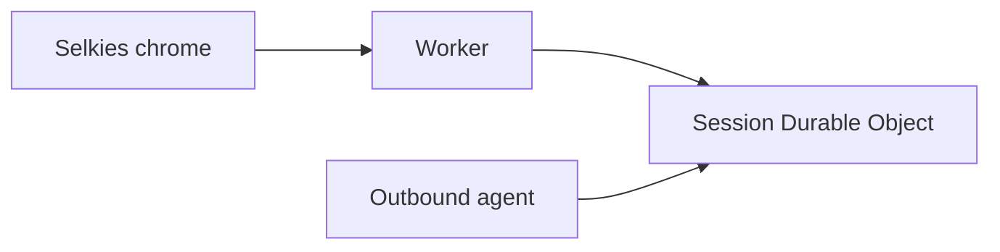
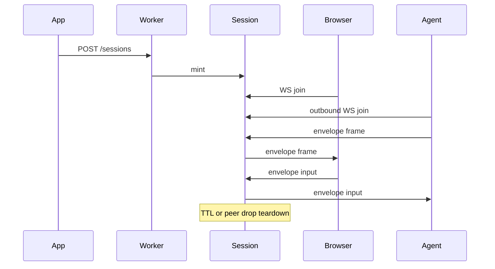
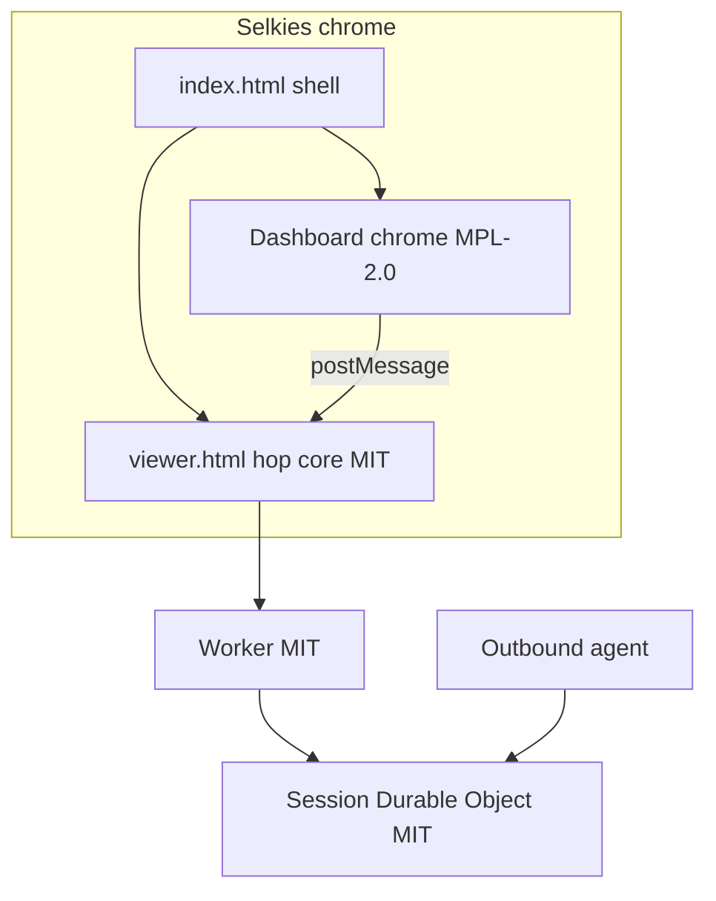

# Architecture

Short-lived browser↔agent session pairing on Cloudflare Durable Objects.

Session-pairing hop on Cloudflare Workers and Durable Objects. See the root README for integration. Diagrams below:

The browser joins through the Worker into the session Durable Object. The agent outbound-connects to that same Durable Object. The DO never dials out.

## Chrome vs hop

`/` is Selkies chrome (modified dashboard, MPL-2.0), the product session UI.

`/viewer.html` is the canvas hole (MIT): PartySocket + envelope + paint + input + postMessage. The Worker and session Durable Object are the MIT pairing pipe. This repo ships modified Selkies dashboard chrome, not the Selkies streaming stack. See [chrome.md](chrome.md).

## Host authorization (tiers)

This hop does **not** implement tenants, Access policies, or device ACLs. Production policing belongs in **your** Workers.

Recommended split:

| Layer | Role |
| --- | --- |
| Cloudflare Access + IdP (optional) | Identity only — prove who signed in. Prefer a wide / multitenant allow; do **not** use Access allow-lists as the real ACL. |
| Portal / control Worker | Users, devices, one-off grants, tier rules (e.g. operator full product vs end-user assigned device only). |
| Hop Worker (this repo) | Mint, pair, forward, TTL. Accept mint only with `MINT_SECRET` (or a service binding from the portal). Issue join tokens; do not interpret Access policies. |

**Tiered access** is enforced when your portal decides whether to mint and for which device — before `POST /sessions`. Examples:

- **Operator tier** — full product UI and device pick (path or picker).
- **End-user tier** — Access identity is enough to enter the session HTML origin. Worker maps identity → linked device(s) and mints only what they are allowed (or refuses).
- **Single linked device** — if the user has exactly one device linked, the portal should take them straight into that session (mint + hop join) with **no device path** in the URL. Multiple linked devices may need a picker; operators keep an explicit device path or admin UI.

Bind shared state (D1/KV/service binding) so the hop or portal can police mint without relying on Access policy changes for every one-off user. The browser join URL stays hop-style: `/?session=<id>#token=<browserToken>` (no device id required in the hop URL).

