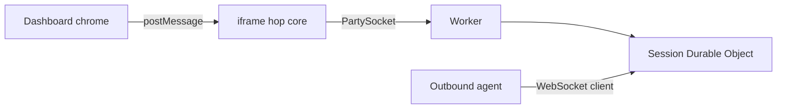

# Dashboard chrome

Product session UI that maps Selkies visual and functional experience onto the Jolee hop. Panels without a hop path remain hidden until one exists.

`/` is the product session UI: modified Selkies dashboard chrome (MPL-2.0) over the hop.

`/viewer.html` is the canvas hole: PartySocket, byte envelope, canvas paint, remote cursor overlay, pointer/key/wheel input, and postMessage. No header, no Connect button, no status pill.

This repo ships modified Selkies dashboard chrome, not the Selkies streaming stack (no selkies-web-core).

Dashboard chrome is MPL-2.0 (see `chrome/selkies-dashboard/LICENSE`). The hop (`src/`, `public/viewer.html`, Worker, Durable Object) is MIT.

## Goal

**Standing UI rule (Lee):** Before changing Selkies dashboard/chrome UI for a broken control, first read stock Selkies at the `UPSTREAM` pin and see what hop (`viewer.html` / core / `postMessage`) change is needed so their existing code works. Prefer hop glue that matches their behavior. Only patch their UI as a last resort when the hop cannot provide what stock expects.


Extract Selkies visual and functional experience onto the Jolee hop. Leftover panels wait until a hop path exists.

Add a real hop path, then show the ORIGINAL Selkies dashboard control. Prefer original UI with only small mods (`postToCore`, overlay hide-flags in `jolee-settings.js`, PC Clipboard label). Do not invent a new UI or large Sidebar rewrites. Gaming stays out unless asked. Slow-add: a panel appears only after its hop exists.

The leftover list is recommended features not yet hopped, not a junk drawer. CSS cursors is original dashboard UI; the remote cursor overlay is hop core in `/viewer.html`.

Chrome keeps only controls the hop can drive. Restore chrome as the hop grows. Hide-flags live in overlay `jolee-settings.js`. The patch series documents that rule in [chrome/patches/selkies-dashboard/README.md](../chrome/patches/selkies-dashboard/README.md).

## Brand and sidebar gutter (overlay)

Keep UI diffs tiny and easy to undo. Brand and layout tweaks live in overlay [`chrome/selkies-dashboard/src/jolee-theme.css`](../chrome/selkies-dashboard/src/jolee-theme.css) (listed in `OVERLAY`; sync does not overwrite it). Loaded after Selkies `Overlay.css` via patch `0012-jolee-theme-import.patch`.

| What | Why |
| --- | --- |
| JO blue tokens | Company brand colors (replace Selkies pink/violet accents) |
| `.sidebar { width: calc(280px + 8px); scrollbar-gutter: stable; }` | Always-on gutter so the long title **Jolee Remote** keeps room and opening/closing sections does not squeeze content |

Do **not** add dynamic gutter JS or large Sidebar rewrites for this. Prefer stock Selkies chrome with these small CSS mods.

**Undo if buggy:** delete only the `.sidebar { … scrollbar-gutter … }` block in `jolee-theme.css` (keep the blue tokens if you still want brand). Rebuild the dashboard (`npm run build:dashboard`). No Sidebar patch to reverse.

## Join

**Tab titles (noVNC-style):** the shell sets `document.title` to `Jolee Remote - {device}` when `?device=` is present (else `Jolee Remote`). This is hop/shell glue, not Selkies static title or Sidebar patches.

The one browser join URL opens Selkies chrome:

```
https://remote.example.com/?session=<id>#token=<browserToken>
```

If the Worker is a different host:

```
https://remote.example.com/?session=<id>&hop=<worker-host>#token=<browserToken>
```

| param | meaning |
| --- | --- |
| `session` | session id from `POST /sessions` |
| `token` | browser join token (prefer `#token=` fragment; `?token=` is fallback) |
| `hop` | Worker host; default this origin. HTML can live on any host you control (docs placeholder: `remote.example.com`) |
| `device` | optional display name for the browser tab (`Jolee Remote - {name}`); set by the host mint redirect (noVNC-style). Not a Selkies static/manifest title — shell/hop glue reads `?device=` in `public/index.html` and may strip it via `history.replaceState`. Do not put secrets here. |

`joins.browser` from mint is a path on the hop Worker (`viewerPath`): `/?session=<id>&hop=<worker-host>#token=<browserToken>`. If HTML is on `https://remote.example.com` and the Worker is elsewhere, prefix that origin and keep `hop`. `public/index.html` copies search params except `token` onto the iframe query, and puts the token on the iframe hash (hash first, then query fallback). The hop core auto-connects. A host app can also postMessage `connect` / `disconnect` to the iframe.

## postMessage contract

Same-origin `window` messages from the parent shell to `iframe#jolee-core`.

**Handled** (the sidebar only shows controls that map here):

| type | payload | action |
| --- | --- | --- |
| `connect` | `{session, token, hop}` | PartySocket join as browser |
| `disconnect` | | close socket |
| `requestFullscreen` | | parent `#jolee-core` iframe `requestFullscreen` in the click tick (`jolee-bridge.js`); on failure the viewer `#stage` (canvas + cursor overlay) tries fullscreen |
| `setScaleLocally` | `{value: boolean}` | CSS object-fit contain vs stretch/fill |
| `setAntiAliasing` | `{value: boolean}` | `ctx.imageSmoothingEnabled` after every canvas size reset |
| `setUseBrowserCursors` | `{value: boolean}` | original CSS cursors toggle. `true`: overlay hidden, local `default` pointer. `false` (default): hide OS pointer, draw remote overlay |
| `showVirtualKeyboard` | | focus canvas and hidden `#vk` |
| `assistKey` | `{e, key, code}` | input envelope `{t:key,...}` from parent `#keyboard-input-assist` |
| `clipboardUpdateFromUI` | `{text}` | input envelope `{t:clipboard, text}` if connected |
| `clipboardImageUpdate` | `{imageBlob}` | Blob/File from the sidebar; viewer base64-encodes and sends `{t:clipboard, mime, data}` if the envelope is ≤ 1 MiB |
| `fileUpload` | `{file}` | base64-encode a parent-picked File and send `{t:"file", name, mime, data}` if the envelope is ≤ 1 MiB |
| `pipelineControl` | `{pipeline, enabled}` | `video`: gate canvas paint + status; `audio`: mute/stop playback + status; `microphone`/`webcam`: capture start/stop (`{t:mic}` / `{t:webcam}`). Mic tries preferred MediaRecorder mimes then bare recorder; failures post `pipelineStatusUpdate` with `error` (no silent no-op). Also input `{t:pipeline, pipeline, enabled}` |
| `audioDeviceSelected` | `{context, deviceId}` | input applied to next/live mic `getUserMedia`; output uses `setSinkId` if present; also `sendInput({t:"audioDevice", context, deviceId})` |
| `setManualResolution` | `{width, height}` | `sendInput({t:"resize", w, h})` |
| `resetResolutionToWindow` | | `sendInput({t:"resize", w:round(innerWidth), h:round(innerHeight), reset:true})` |
| `setUseCssScaling` | `{value: boolean}` | `sendInput({t:"cssScaling", value})` |
| `settings` | `{settings}` | if present, `sendInput({t:"settings", settings})` covering `scaling_dpi` and `force_aligned_resolution` |
| `command` | command payload | input `{t:"command", ...}`; Ctrl+Alt+Del spellings normalize to `command:"ctrl-alt-delete"` |
| `getStats` | | immediately publish the current hop/agent stats snapshot |

Core to parent (only when window.parent is not window):

| type | payload |
| --- | --- |
| `status` | `{state: waiting | paired | expired | disconnected}` |
| `clipboardContentUpdate` | `{text}` — viewer saw a frame whose payload is UTF-8 JSON `{"t":"clipboard","text":"..."}`. Hop does not parse it. |
| `clipboardImageUpdate` | `{mime, data}` — viewer saw a JSON clipboard frame with `mime` starting `image/` and base64 `data`. Sidebar may ignore this. |
| `pipelineStatusUpdate` | microphone/webcam active state after permission and capture start/stop |
| `statsUpdate` | dashboard globals for CPU, memory, GPU, FPS, bandwidth, latency, and audio level |
| `printJob` | `{name, mime}` — optional chrome awareness when a print JSON frame arrives (no blob URL). Parent may ignore. |

## What's left

**Visible now:** screen and agent-owned encoder preference (default H.264; JPEG fallback) + frame-rate/JPEG-quality settings, PC clipboard text+image, audio playback, microphone capture, file upload/download, webcam JPEG stills, stats gauges, a Ctrl+Alt+Del shortcut, fullscreen, theme, and mobile keyboard. Session print frames open the browser print dialog / preview in the hop viewer (PDF preferred); silent OS spool stays desktop-client only. Paint-over and the other Selkies-only encoder controls stay hidden. Overlay is hop core; CSS cursors is original UI. There is no pixelflux.

**Hidden until that hop exists** (leftover list):

- Apps
- Sharing
- Gaming (out unless asked)

Gaming (gamepads, gaming mode, trackpad, extra player seats) stays hidden. Image clipboard is unlocked: it is a hop JSON path, not a Selkies pixelflux encoder. A leftover postMessage of still-hidden types is ignored so a stale build cannot crash the core.



## Keeping chrome in sync

### Goal

Extract Selkies visual and functional experience onto the Jolee hop. Leftover panels wait until a hop path exists.

Add a real hop path, then show the ORIGINAL Selkies dashboard control. Prefer original UI with only small mods (`postToCore`, overlay hide-flags in `jolee-settings.js`, PC Clipboard label). Do not invent a new UI or large Sidebar rewrites. Gaming stays out unless asked. Slow-add: a panel appears only after its hop exists.

The leftover list is recommended features not yet hopped, not a junk drawer.

This repo ships modified Selkies dashboard chrome, not the Selkies streaming stack (no selkies-web-core).

The patch series exists to rewire that chrome onto the hop canvas. Add chrome back as the hop grows; a panel appears only after its hop exists. Prefer overlay `src/jolee-settings.js` hide-flags so Sidebar diffs stay small. See [chrome/patches/selkies-dashboard/README.md](../chrome/patches/selkies-dashboard/README.md).

Do not bump packages past what the source uses: dashboard npm follows the pinned Selkies package.json; wrangler, workers-types, partyserver, and partysocket follow those sources, not latest-on-npm.

Dependabot covers npm weekly (Monday) at `/` and `/chrome/selkies-dashboard`, plus GitHub Actions at `/`. The dashboard is pinned in `chrome/selkies-dashboard/UPSTREAM`; overlay files in `OVERLAY` are kept; Jolee rewires are `chrome/patches/selkies-dashboard/` plus `scripts/sync-selkies-dashboard.sh` (`latest` or a SHA). A weekday Action opens an issue titled "Selkies dashboard upstream moved" when the pin is behind.

