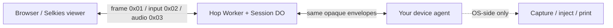
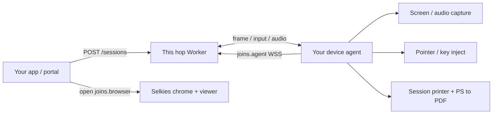

# Consumer agent tool map

**Audience:** someone building the outbound hop agent (capture, input, print, …).  
**Rule:** prefer existing tools and OS APIs. Do not reinvent stacks this hop already defines on the wire, and do not copy large projects into this repo — depend on them in **your** agent so they update upstream.

This hop only ships mint/pair/TTL, opaque envelopes, and the Selkies viewer. Everything below is **your** side unless marked “shipped here.”

## Hop protocol toolkit (shipped here)

Import (or copy) **`src/agent-tools.ts`** — the single entry for hop wire helpers a device agent needs:

- Envelope: `encodeEnvelope` / `decodeEnvelope`, kinds, `MAX_ENVELOPE_BYTES`
- Join paths: `viewerPath`, `agentJoinPath`, …
- Input parse: `parseInputPayload` / `parseInputJson` (`src/input.ts`) — browser → agent kind `0x02` JSON
- Frame builders: `encodeClipboard*Frame`, `encodeCursorFrame`, `encodeFileFrame`, `encodeStatsFrame`, `encodePrintFrames` (`src/agent-frames.ts`) — agent → browser kind `0x01` JSON
- Frame parsers: `printFromFrame`, `fileFromFrame`, … (`src/json-frame.ts`)

**Wire format only.** Capture (DXGI / WGC / LetLeeIn native capture when you wire it), SendInput inject, Ghostscript PS→PDF, and IronRDP-style print job lifecycle stay in **your** agent — do not fork those designs into this repo. `examples/agent.mjs` stays a tiny synthetic pipe proof.

## End-to-end map

## Tool map (use these)

| Need | Prefer (existing) | Do not build here | Hop wire |
| --- | --- | --- | --- |
| Mint + join URLs | This hop: `POST /sessions`, `joins.browser` / `joins.agent` ([agent.md](agent.md)) | Custom pairing DO | HTTP + WSS |
| Screen capture | OS APIs: Windows DXGI / WGC (or platform equivalent); encode H.264 (preferred) or JPEG/WebP stills | Selkies pixelflux / RFB / UltraVNC in this repo | kind `0x01` frame bytes |
| Pointer / key / wheel | OS inject (e.g. Windows `SendInput`); honor viewer JSON | Fake input in the Worker | kind `0x02` input JSON |
| Ctrl+Alt+Del | Same inject path; viewer sends `{t:"command", command:"ctrl-alt-delete"}` | Custom CAD in chrome only | input JSON |
| Cursor shape | Your capture stack’s cursor bitmap + hotspot | Copying selkies-web-core | frame JSON `{t:"cursor",…}` |
| Clipboard text/image | OS clipboard APIs ↔ hop JSON | New envelope kinds | input / frame `{t:"clipboard",…}` |
| Audio playback to browser | Your encode → complete media chunks | New codec in the hop | kind `0x03` audio |
| Mic / webcam from browser | Browser already captures; agent consumes `{t:"mic"}` / `{t:"webcam"}` | Re-encoding in the Worker | input JSON |
| Files | OS file I/O under consumer `FileManagerPath` / Desktop | New transfer protocol or envelope kinds | upload `{t:"file",…}` input; `filesList` / `filesGet` input + frame; optional `{t:"file",…}` push frame |
| Stats gauges | Your process/GPU metrics → `{t:"stats",…}`; viewer also measures FPS/bandwidth | Pixelflux stats | frame JSON |
| Encoder / quality settings | Your encoder; honor `{t:"settings",…}` / resize | Claiming this hop has pixelflux | input JSON |
| **Session print** | See below | Custom RDPDR fork in this repo | frame `{t:"print",…}` |
| Auth / tenants / devices | Your portal / Access / fleet | Tenants in this public hop | outside hop |
| Browser print UI | **Shipped here** — viewer print dialog | Silent print from Chrome | — |

## Files path (locked Option A)

Prefer OS file I/O under the consumer agent's PC `FileManagerPath` / Desktop root. The consumer owns path resolution; the hop forwards opaque payloads.

- Upload: browser → agent kind `0x02` `{t:"file",name,mime,data}` (`data` base64); the agent writes into that root.
- List/get: `filesList` / `filesGet` requests in kind `0x02`, responses in kind `0x01`. Listing is root-only; get uses a basename. Exact shapes, errors, and `mtime` units: [agent.md — Files](agent.md#files-locked-option-a).
- Optional canary/push: agent → browser kind `0x01` `{t:"file",name,mime,data}` triggers a browser download; it is distinct from `filesGet`.
- The whole binary envelope, including header, JSON, and base64 expansion, must be ≤ 1 MiB (`MAX_ENVELOPE_BYTES`). Do not build a new transfer protocol or envelope kinds in this hop.

UI **Download Files** and the `letleeadmin` CLI target the same PC folder via the Worker asking the paired agent. A Session DO inbox, if a consumer uses one, is interim only, not the end state.

## Print path (detail)

| Step | Tool |
| --- | --- |
| Session-only queue | Windows print APIs (add on **paired**, remove on teardown). RDP session-printer UX. |
| Job lifecycle (Create / Write / Close) | Cite [IronRDP](https://github.com/Devolutions/IronRDP) [`ironrdp-rdpdr`](https://crates.io/crates/ironrdp-rdpdr) (`Rdpdr::with_printer`, `handle_printer_io_request`). Depend on the crate in an RDP-**client** consumer; on a device agent, mirror that lifecycle against your session queue — do not vendor IronRDP into this hop. Spec: [MS-RDPEFS](https://learn.microsoft.com/en-us/openspecs/windows_protocols/ms-rdpefs/34d9de58-b2b5-40b6-b970-f82d4603bdb5). |
| Default PS driver name | `MS Publisher Imagesetter` (IronRDP / FreeRDP default) when present on the host |
| PostScript → PDF | **Ghostscript** (or equivalent). Convert **before** the hop. |
| Send to browser | This hop: `{t:"print", mime:"application/pdf", …}` (+ chunking). Viewer opens print dialog. |

Full print how-to: [print-redirect.md](print-redirect.md).

## Checklist for a first real agent

1. Mint with secret; open `joins.browser`; agent dials `joins.agent`; wait for `paired`. Use `src/agent-tools.ts` for envelope/input/frame helpers.
2. Capture → H.264 (preferred) or JPEG/WebP frames under 1 MiB; optional audio `0x03`.
3. Apply pointer/key/wheel/command on device.
4. Clipboard / cursor / files / stats as needed (JSON frames + input).
5. Print: session queue → buffer → Ghostscript → print frames.
6. Teardown: stop capture, remove session printer, drop sockets.

Sample `examples/agent.mjs` only proves the pipe (placeholder frames + cursor). It is not a capture or print agent.

## Related

- [agent.md](agent.md) — mint, envelope, input shapes
- `src/agent-tools.ts` — hop protocol toolkit (import/copy)
- [print-redirect.md](print-redirect.md) — print how-to + IronRDP cites
- [chrome.md](chrome.md) — viewer chrome
- [architecture.md](architecture.md) — pairing diagram
